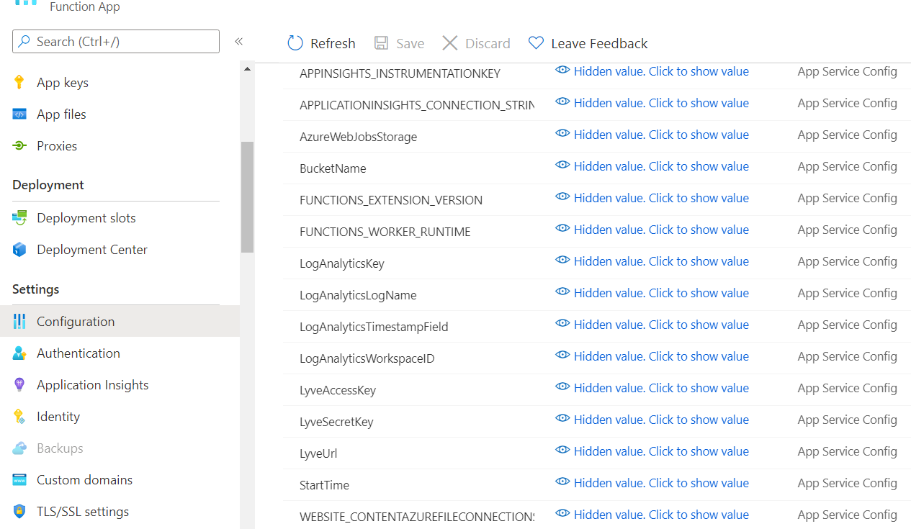
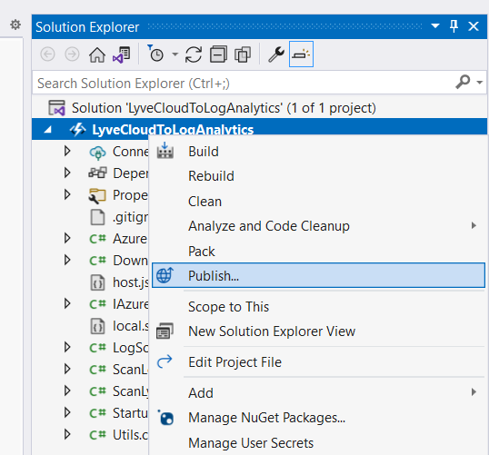
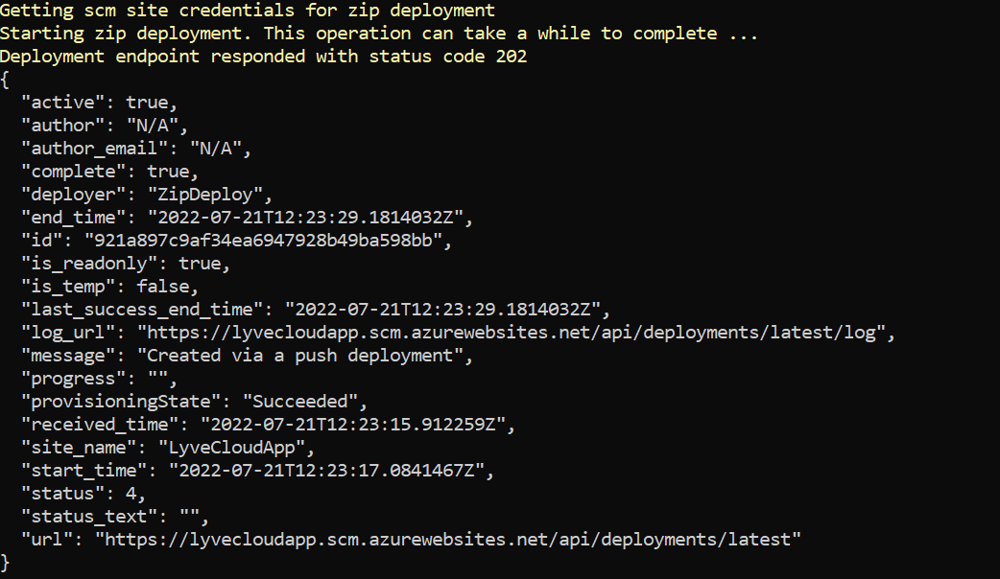
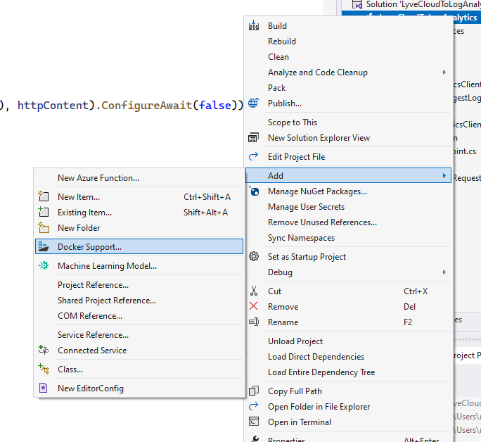
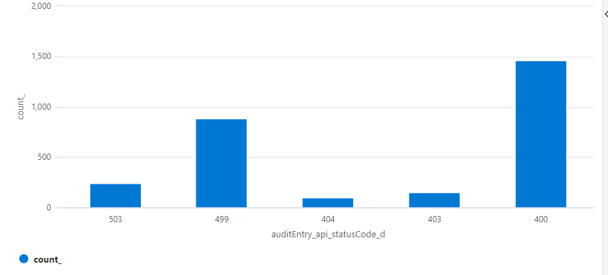
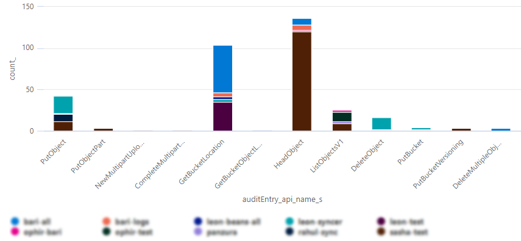
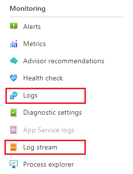

# Lyve Cloud Logs Ingestion to Azure Monitor

## Introduction
This integration solution is between Lyve Cloud audit logs and Azure Monitor (Azure Log Analytics). Each round hour it scans for new audit log files in a specified bucket and ingest them into Azure Log Analytics workspace. The user can choose whether to ingest all types of audit logs or only one type (S3/IAM/Console). The application was built using Azure Functions tools.

## Requirements
* Lyve Cloud
  * Access Key 
  * Secret Key
  * S3 API Endpoint
  * Name of the bucket that contains the audit logs
* Azure Log Analytics
  * Log Analytics Workspace
  * Workspace ID
  * Log Analytics Primary/Secondary Key

## Known Limitations
1. Every scan the integration goes through all the audit log files in the bucket to find the new audit logs.
2. This integration solution sequentially processes API audit logs from a single tenant.

## Running Steps
This document contains the following options for publishing the app:
1. [Publish as a code via Visual Studio](#option-1---publish-as-a-code-via-visual-studio)
2. [Publish as a code via ZIP file](#option-2---publish-as-a-code-via-zip-file)
3. [Publish as a Docker container](#option-3---publish-as-a-docker-container)
4. [Run it locally](#option-4---runtest-locally)

### Create Function App in Azure Portal
#### Prerequisites
* Azure subscription
* Azure Functions Premium plan<br>
  <sub>*Note: ‘Consumption plan’ might be sufficient but due to running time may take several minutes, we advise to use 'Premium plan'.*</sub>

1. Sign in to the [Azure portal](https://portal.azure.com/) with your Azure account.
2. From the Azure portal menu or the Home page, select **Create a resource**.
3. In the New page, select **Compute** > **Function App**.
4. On the **Basics** page, fill the specific function app settings as specified in the following table:

  | Setting  | Value |
  | ------------- | ------------- |
  | Publish  | **Code** to publish as a code  / **Docker container** to publish as a container  |
  | Runtime stack  | .NET  |
  | Version  | 3.1  |
  | Operating system  | *Windows* - Azure will auto select which OS is preferred  |
  | Plan  | Functions Premium <sub>(See note under Prerequisites)</sub>)  |
  
  All the other settings can be filled as preferred by the user.
  
5. Select **Review + create** to review the app configuration selections.
6. On the **Review + create page**, review your settings, and then select **Create** to provision and deploy the function app.
7.	In the search bar at the top of the portal, enter the name of your function app and select it from the list.
8.	Under **Settings** in the left pane, select **Configuration**.
9.	To add the needed settings, select **New application setting** and add the [following key-value pairs](#settings). These settings can also be added by clicking on **Advanced edit** under **Application settings**, and pasting the [following blocks](https://github.com/barviv-seagate/bari-test/blob/alexander/Azure%20Monitor/settings.json) after they have been filled in.
10. Click on **Save**

Example of how the settings should look:<br>
<p align="center">
  <br>
</p>

### Settings
These are the settings you will need to configure before running the application.

  | Key  | Value |
  | ------------- | ------------- |
  | LyveCloudS3APIEndpoint  | Lyve Cloud Endpoint URL  |
  | LyveCloudAccessKey  | Access Key to the Lyve Cloud API  |
  | LyveCloudSecretKey  | Secret Key to the Lyve Cloud API  |
  | AuditLogsBucketName  | Name of the bucket that contains the audit logs  |
  | LogAnalyticsWorkspaceID  | Workspace ID of the Azure Log Analytics workspace  |
  | LogAnalyticsKey  | Log Analytics Primary/Secondary key  |
  | StartTime  | Optional - Date from which the audit logs should be taken. e.g. "5/31/22". If setting doesn't exist, audit logs will be taken from the last hour  |
  | LogType  | Optional - Which audit log type should be taken. e.g. "S3"/"IAM"/"Console". If setting doesn't, all types will be taken  |
  
  Note:
  More information on where to get **Workspace ID** and **Log Analytics Primary key** you can find [here](#get-log-analytics-workspace-credentials).
  
### Publish to the created Function app
#### Option 1 - Publish as a code via Visual Studio
*Visual Studio 2019/2022 required.*

1.	Open the project in Visual Studio.
2.	Right click on the projects name and select Publish.


<p align="center">
  <br>
</p>

3. Click on **Add a publish profile**.
4.	Choose Azure as the publish target, click Next.
5.	Choose **Azure Function App** to publish as a code and click **Next**.
6. Choose the Function app that you created previously. Click on **Finish**.

<p align="center">
  <br>
</p>

7. In the Visual Studio publishing window click on **Publish**.

#### Option 2 - Publish as a code via ZIP file
*Azure CLI required.*

If you don't have Azure CLI installed:
1. [Install it from here](https://docs.microsoft.com/en-us/cli/azure/install-azure-cli).
3. In your preferred CLI, run the login command `az login`.
4. The CLI will initiate authorization code flow.
5. Sign in with your account credentials in the browser.

Publish:
1. In your CLI, go the *zip* folder that is inside this repository, on your local machine.
2. Run the following command.
```
az functionapp deployment source config-zip -g <resource_group> -n \
<app_name> --src LyveAuditLogsToAzureMonitor.zip
```

3. If the publishing was successful, the output should look like this:
<p align="center">
  <br>
</p>


#### Option 3 - Publish as a Docker container
*Docker Desktop and Visual Studio 2019/2022 are required.*

1.	Open the project in Visual Studio.
2. Add Docker support to the project by right clicking on the app name -> Add -> Docker Support.
<p align="center">
  <br>
</p>

3. Right click on the projects name and select Publish.
4. Click on **Add a publish profile**
5. Choose Azure as the publish target, click **Next**.
6. Choose **Azure Function App Container** to publish as a docker container. Click Next.
7. Choose the Function app that you created previously. Click on **Finish**.
8. In the Visual Studio publishing window click on **Publish**.

#### Option 4 - Run/Test locally
*Visual Studio 2019/2022 required.*

1. Go to the local.settings.json file inside the project, and set its values as explained in the [following table](#settings).
2. Simply click on the **Run** button. 

## Results 
After a successful deployment, the function will be triggered in the closest round hour and you should be able to see the collected data in Azure Log Analytics under **Logs > Custom Logs**. It is possible that it will take up to 20 minutes to see the results. 
The name of custom log will be according to the functions settings: "lyvecloud_LogType_auditlogs_StartTime_CL".

<p align="center">
  <br>
</p>

## Sample Log Analytics Queries
Once the logs are inside the Azure Log Analytics you can run various queries and create visualization. The name LyveLogs_CL will be used in the examples as the name of the log inside Azure Log Analytics.

### Count of failed http status responses in a specific time frame
```
lyvecloud_S3_auditlogs_01_14_22_12_50_00_CL
|where auditEntry_api_statusCode_d > 206 and isnotempty(auditEntry_api_statusCode_d)
|where auditEntry_time_t between (datetime(3-1-2022)..datetime(3-30-2022))
|summarize count() by auditEntry_api_statusCode_d
|render columnchart 
```

<p align="center">
  <br>
</p>

### Extra data about failed http responses. Who is the service account, what was the request, from which environment was the request made
```
lyvecloud_S3_auditlogs_01_14_22_12_50_00_CL
|where auditEntry_api_statusCode_d > 206 and isnotempty(auditEntry_api_statusCode_d)
|where auditEntry_time_t between (datetime(3-1-2022)..datetime(3-30-2022))
|project auditEntry_api_name_s, auditEntry_api_statusCode_d, serviceAccountName_s, auditEntry_api_status_s, auditEntry_userAgent_s 
```

<p align="center">
  <br>
</p>

### Which specific S3 operations(GetObject, ListObjectsV2, ListBuckets, HeadObject) did each service account during a specific time frame (from 5-1-2022 to 5-30-2022), not including console operations
```
lyvecloud_S3_auditlogs_01_14_22_12_50_00_CL
|where auditEntry_time_t<>""
|where auditEntry_api_name_s in("GetObject", "ListObjectsV2", "ListBuckets", "HeadObjects")
|where auditEntry_time_t between (datetime(5-1-2022)..datetime(5-30-2022))
|summarize count() by auditEntry_api_name_s, serviceAccountName_s
```

<p align="center">
  <br>
</p>

### User operations using console
```
lyvecloud_Console_auditlogs_07_12_22_10_00_00_CL
|where ConsoleEvent_Eventname_s<>""
|where UserIdentity_UserName_s<>""
|summarize count() by ConsoleEvent_Eventname_s, UserIdentity_UserName_s
```

<p align="center">
  <br>
</p>

### Most used buckets of all time
```
lyvecloud_S3_auditlogs_01_14_22_12_50_00_CL
|where isnotempty(auditEntry_api_bucket_s)
|summarize count() by auditEntry_api_bucket_s
|render piechart 
```

<p align="center">
  <br>
</p>

### Total operations count service account did in every API action
```
lyvecloud_S3_auditlogs_01_14_22_12_50_00_CL
|where auditEntry_api_name_s<>""
|where serviceAccountName_s<>"" 
|summarize count()  by auditEntry_api_name_s, serviceAccountName_s 
```
<p align="center">
  <br>
</p>

## Helpful Information

### Logging
In order to monitor the integrations activity, it creates own logs which can be viewed live in function's **Log stream**, or recorded logs can be viewed in **Logs**. 
<p align="center">
  <br>
</p>
If an audit logs file was processed successfully, it will log a message "Processed: LogName.gz". In case of a failure, it will log the failure cause.

### Get Log Analytics Workspace credentials
Note: If you don’t have existing workspace, [create one](https://docs.microsoft.com/en-us/azure/azure-monitor/logs/quick-create-workspace) 

1.	Select the workspace from the Log Analytics workspaces menu in the Azure portal.
2.	Select Agents management in the Settings section.
3.	Copy the Workspace ID and key on the page.

## Tested by:
* July 21 2022: Alexander Chernin (alexander.chernin@seagate.com) on Windows 10

### Project Structure

This section will describe the representation of each of the folders or files in the structure.
```
.
├── README.md
├── settings.json
├── code
│   └── AzureLogAnalyticsClient.cs
│   └── IAzureLogAnalyticsClient.cs
│   └── LogScanCheckpoint.cs
│   └── LyveCloudToLogAnalytics.csproj
│   └── LyveCloudToLogAnalytics.csproj.user
│   └── ScanLogs.cs
│   └── Startup.cs
│   └── Utils.cs
│   └── host.json
│   └── local.settings.json
├── zip
    └── LyveAuditLogsToAzureMonitor.zip
```

### `/code`
This folder contains, all the code files.

### `/images`
This folder contains, all the images.

### `/zip`
This folder contains the ZIP deployment file.

