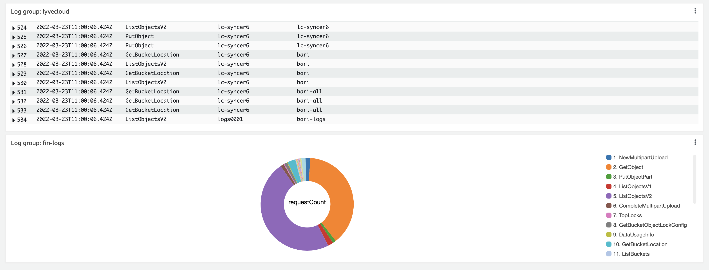

# CloudWatch – How to send Lyve Cloud Audit Logs to AWS CloudWatch

[Video Link](documentation/demo.mp4)

## Introduction
This integration solution sends Lyve Cloud S3 API Audit Log events to be consumed and displayed in AWS CloudWatch.
The procedure will continuously send Lyve Cloud S3 API Audit Logs to AWS CloudWatch. AWS CloudWatch collects monitoring and operational data in the form of logs, metrics, and events and provides you with actionable insights to improve your IT operations using S3 storage. 
A sample dashboard using the imported S3 API Audit Log events is also provided.

## Requirements
Before you start, please make sure you have these requirements and information in place:
* [`Python 3`](https://www.python.org/downloads/) and above is required.
* Lyve Cloud access and secret keys. These can be obtained from the Lyve Cloud Console by creating a new Service Account to be used by this solution.
* IAM user with CloudWatchAgentServerPolicy to AWS CloudWatch.

## Known Limitations
This repository provides sample code to show how S3 API Audit Logs can be pulled from Lyve Cloud into AWS CloudWatch, but it’s by no means a complete solution. 
There are limitations and functionality gaps to handle before this sample code can be used in a production environment:
* This integration solution pulls new generated S3 API Audit Logs from Lyve Cloud once an hour. Notice, Audit Logs generated before the application is started will not be pulled into AWS CloudWatch.
* This solution imports S3 API Audit Logs, other types of Lyve Cloud Audit Logs such as Console or IAM Audit Logs will not be imported.
* Error reporting is limited, so failures encountered during Audit Logs pull might not be reported.
* Credentials are kept in a clear text.
* This example requires full access permissions to AWS CloudWatch.
* This integration solution sequentially processes S3 API audit logs from a single tenant.

## Running Steps
### Step 1: Get your Lyve Cloud bucket credentials for use with CloudWatch.
Here's what you'll need:
* Access Key
* Secret key
* Endpoint URL

### Step 2: Generate AWS keys for CloudWatch
1. Login to AWS and go over to [IAM](https://console.aws.amazon.com/iamv2/home).
2. Click on the "Users" tab.
3. Click "Add Users".
4. Enter any username you would like. Under the "Select AWS access type" select "Access key - Programmatic access".
5. In the permissions page, select "Attach existing policies directly".
6. Search for "CloudWatchFullAccess" and select it. **Warning: this policy will provide access to all CloudWatch. To limit access, you can read more about IAM policies for CloudWatch [here](https://docs.aws.amazon.com/AmazonCloudWatch/latest/monitoring/iam-identity-based-access-control-cw.html)**.
7. Click "Next: Tags".
8. Click "Next: Review".
9. Click "Create user".
10. Your keys are now generated, copy the "Access Key ID" and "Secret access key". These will be used to upload the logs into CloudWatch.

### Step 3: Create CloudWatch log stream
1. In the AWS console go over to CloudWatch. **Important: notice the region you are on and using. It is critical for configuration.**
2. Select "Log groups".
3. Click on "Create log group".
4. Provide a name for your log group.
5. Click on "Create".
6. After being redirected to the log group table, select the newly created log group.
7. Under "Log streams", click "Create log stream".
8. Provide a name for your stream and click "Create". **Save this name! You will need it for configuration**.

### Step 4: Set up your environment
**Set up without Docker:**
1. Install all required packages: `pip3 install -r requirements.txt`.
2. Fill in the relevant configurations in `config.json`.
3. Copy the `cron` file to `/etc/cron.d/cron`. **Notice: the cron is configured to run the script at `/app/engine.py` if you installed in a different location, please update `cron`**.
4. Run `service cron start`.
5. Run `chmod +x /etc/cron.d/cron`.
6. Run `crontab /etc/cron.d/cron`.
7. Run `touch /var/log/cron.log`.
8. **Optional:** You can test the script by running `python3 engine.py`.

**Set up with Docker:**
1. Run `docker build -f Dockerfile -t convertor .`
2. Run `docker run -d convertor`.
3. Run `python3 engine.py`.

**Note:** To run the script on demand: run `python3 engine.py`.

### Step 5: Set up CloudWatch dashboard
1. Go to AWS CloudWatch.
2. Select "Dashboards".
3. Click "Create Dashboard".
4. Name your dashboard and click "Create dashboard".
5. A popup will appear, if you would like to create your own dashboard, you can do so from here. If you would like to use a template, choose from the `dashboards` and continue from here.
6. Click "Cancel".
7. open the dashboard file you would like to use under and replace the fields written with `<>`.
8. Click on "Actions" -> "View/Edit source".
9. Delete anything in the textboxt and copy the source from the dashboard file.

## Results 
After a successful implementation you should see the following dashboard: 


## Tested by:
* December 12, 2021: Avi Wolicki on Linux
* December 12, 2021: Yinnon Hadad on Linux
* March 23, 2022: Bari Arviv (bari.arviv@seagate.com) on CentOS

### Project Structure

This section will describe the representation of each of the folders or files in the structure.
```
.
├── README.md
├── dashboards
│   └── requests_count.json
├── documentation
│   └── demo.mp4
│   └── introduction.pptx
├── services
│   └── pull_logs_service.py
│   └── upload_cloudwatch_logs_service.py
├── utils
│    └── json_extractor.py
├── requirements.txt
├── engine.py
├── config.json
└── .gitignore
```

### `/dashboards`
This folder contains examples of dashboards that can be imported to CloudWatch.

### `/services`
This folder contains the scripts that are used for fetching and uploading the logs.

### `/utils`
This folder contains scripts that are used as helpers for the scripts.

### `/images`
Contains images for the documentation.

