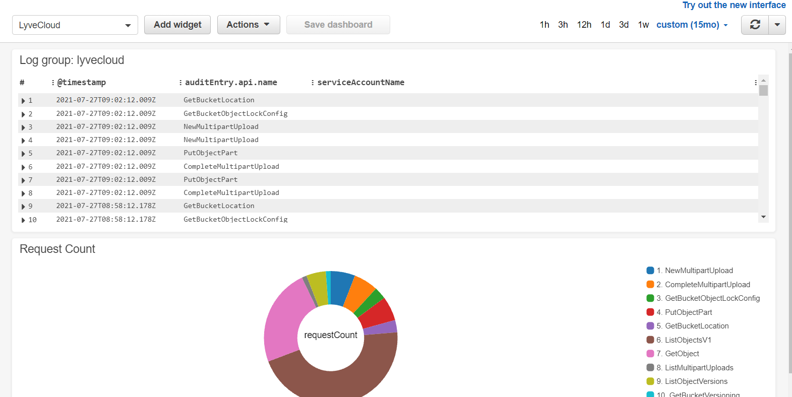

# CloudWatch - Send LyveCloud logs to AWS CloudWatch

[Video Link](documentation/demo.mp4)

## Introduction
CloudWatch convert allows you to programmatically sync logs from your LyveCloud to AWS CloudWatch.  

## Requirements
The script is built using `Python3` and so `Python3` and above is required. You are also required to have Lyve Cloud keys and admin access to AWS CloudWatch. 

## Included and Not-Included
#### Include
* Docker with API translation from LyveCloud to AWS CloudWatch.
* Log translation from installation time.
* One sample dashboard.

#### Not-Included
* Collecting logs created prior the installation.
* Syslog mechanism.
* Not cluster configuration - HA, Load Balance between dockers, etc.
* Integration with CloudTrail.
* Security best practices are not enforced.

## Running Steps
### Step 1: Get your Lyve Cloud bucket credentials  
Here's what you'll need:
* Access Key
* Secret key
* Endpoint URL

### Step 2: Generate AWS keys for CloudWatch
1. Login to AWS and go over to IAM (https://console.aws.amazon.com/iamv2/home)
2. Click on the "Users" tab
3. Click "Add Users"
4. Enter any username you would like. Under the "Select AWS access type" select "Access key - Programmatic access"
5. In the permissions page, select "Attach exisiting policies directly"
6. Search for "CloudWatchFullAccess" and select it. **Warning: this policy will provide access to all CloudWatch. To limit access you can read more about IAM policies for CloudWatch [here](https://docs.aws.amazon.com/AmazonCloudWatch/latest/monitoring/iam-identity-based-access-control-cw.html)**
7. Click "Next: Tags"
8. Click "Next: Review"
9. Click "Create user"
10. Your keys are now generated, copy the "Access Key ID" and "Secret access key". These will be used to upload the logs into CloudWatch.

### Step 3: Create CloudWatch log stream
1. In the AWS console go over to CloudWatch. **Important: notice the region you are on and using. It is critical for configuration.**
2. Select "Log groups"
3. Click on "Create log group"
4. Provide a name for your log group
5. Click on "Create"
6. After being redirected to the log group table, select the newly created log group
7. Under "Log streams", click "Create log stream"
8. Provide a name for your stream and click "Create". **Save this name! You will need it for configuration**

### Step 4: Set up your enviorment 

**set up without Docker:**
1. Install all required packages: `pip3 install -r requirements.txt`
2. Copy `config.example.json` and rename it to `config.json`.
3. Fill in the relevant configurations in `config.json`
4. Copy the `bubble-cron` file to `/etc/cron.d/bubble-cron`. **Notice: the cron is configured to run the script at `/app/engine.py` if you installed in a different location, please update `bubble-cron`**
5. Run `service cron start`
6. Run `chmod +x /etc/cron.d/bubble-cron`
7. Run `crontab /etc/cron.d/bubble-cron`
8. Run `touch /var/log/cron.log`
9. **Optional:** You can test the script by running `python engine.py`

**set up with Docker:**
1. Run `docker build -f Dockerfile -t bubble-convert`
2. Run `docker run bubble-convert`.

### Step 5: Set up CloudWatch dashboard
1. Go to AWS CloudWatch
2. Select "Dashboards"
3. Click "Create Dashboard"
4. Name your dashboard and click "Create dashboard"
5. A popup will apear, if you would like to create your own dashboard, you can do so from here. If you would like to use a template, choose from the `dashboards` and continue from here
6. Click "Cancel"
7. open the dashboard file you would like to use under and replace `SOURCE 'lyvecloud'` with `SOURCE <ENTER_CLOUDWATCH_LOG_STREAM_HERE>`
8. Click on "Actions" -> "View/Edit source"
9. Delete anything in the textboxt and copy the source from the dashboard file

## Results 
If all goes well and everything is deployed properly, you should see the following dashboard:


## Tested by:
* December 12, 2021: Avi Wolicki on Linux
* December 12, 2021: Yinnon Hadad on Linux
* December 19, 2021: Bari Arviv (bari.arviv@seagate.com) on Windows

### Project Structure

This section will describe the representation of each of the folders or files in the structure.
```
.
├── README.md
├── dashboards
│   └── requests_count.json
├── documentation
│   └── demo.mp4
│   └── introduction.pptx
├── services
│   └── pull_logs_service.py
│   └── upload_cloudwatch_logs_service.py
├── utils
│    └── json_extractor.py
├── requirements.txt
├── engine.py
├── config.example.json
└── .gitignore
```

### `/dashboards`
This folder contains examples of dashboards that can be imported to CloudWatch.

### `/services`
This folder contains the scripts that are used for fetching and uploading the logs. 

### `/utils`
This folder contains scripts that are used as helpers for the scripts.

### `/images`
Contains images for the documentation.

