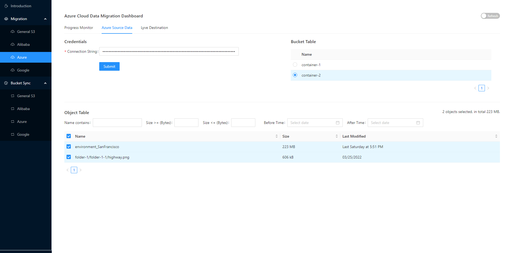
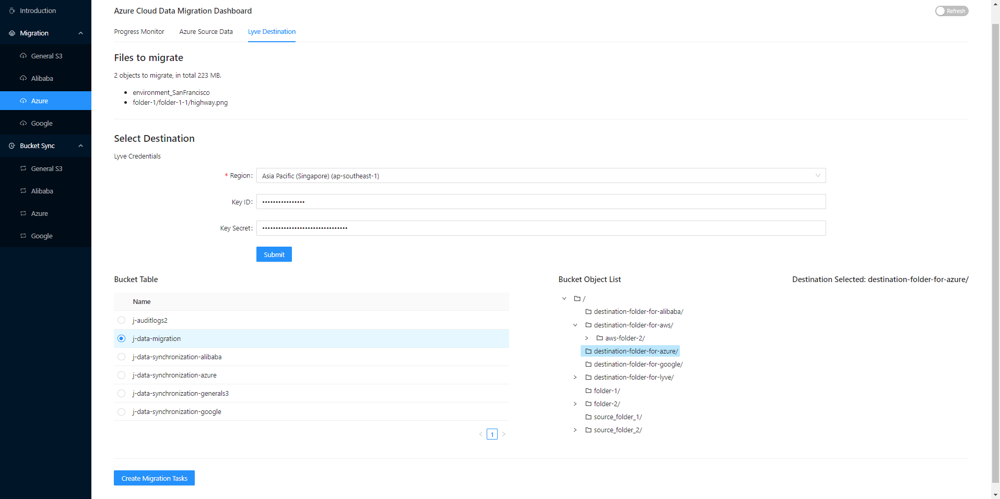
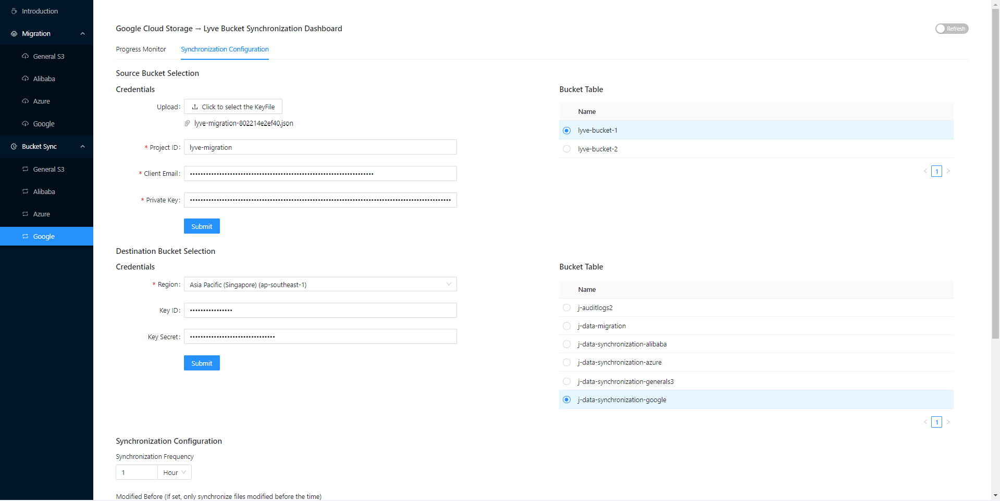
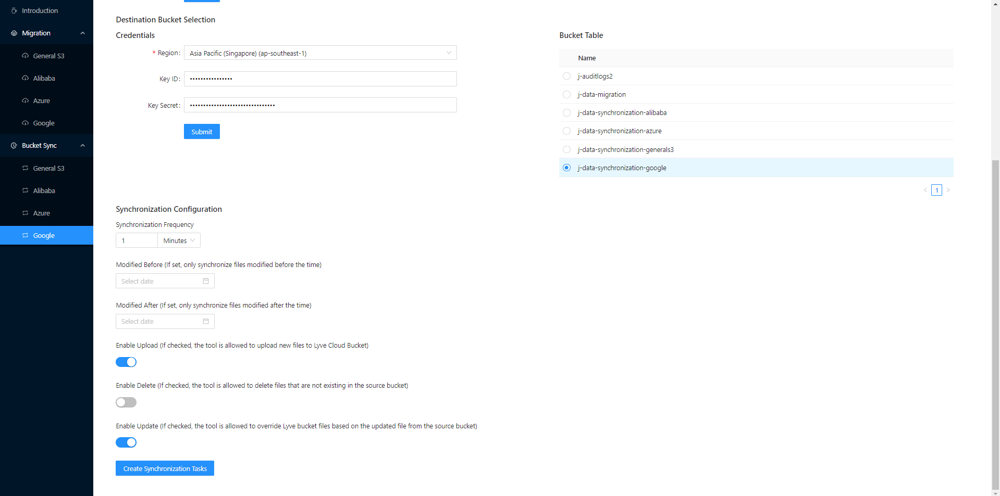
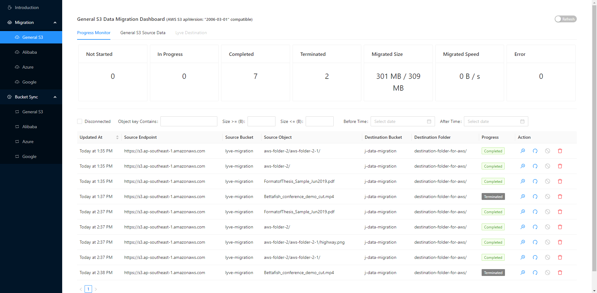
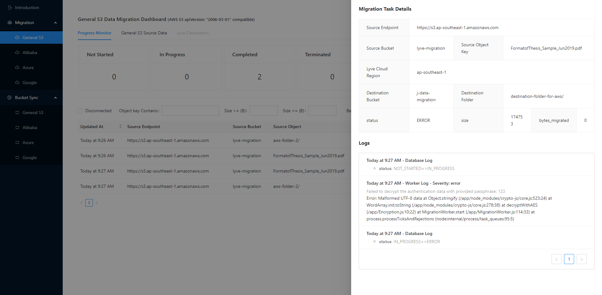
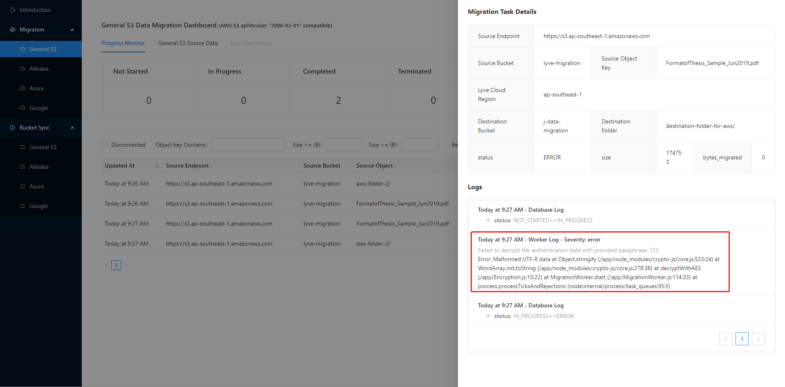
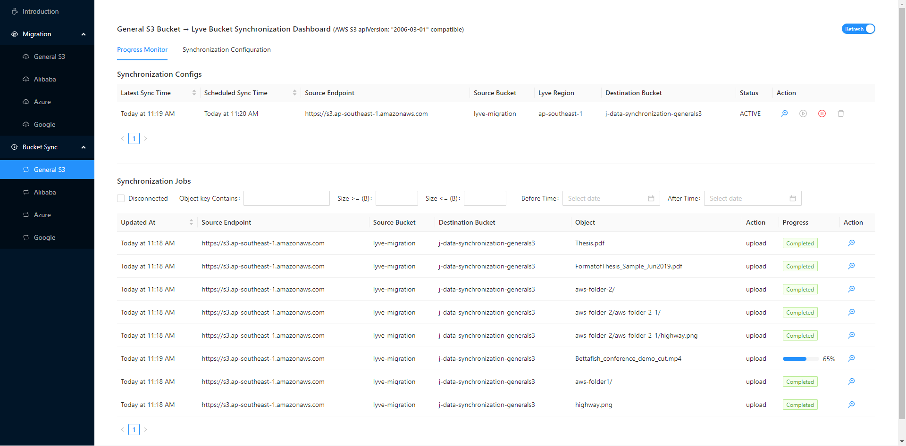

# Data Migration and Synchronization Web Application

[Video Link](https://www.youtube.com/watch?v=k_-nLFwmF9I)

## Introduction
This is a full-stack solution for easily migrating and synchronizing files from other cloud services to Lyve Cloud.

Users can submit **one-time migration tasks** to Lyve Cloud from various cloud providers such as Lyve Cloud, AWS S3,
Alibaba OSS, Google Cloud Storage, and Azure Containers.

Users can also set up **continuous bucket synchronization tasks**, for automatically synchronizing buckets or containers
from other cloud providers to Lyve Cloud.

## Requirements
* [`Docker 20.10.14`](https://docs.docker.com/get-docker/) and above.
* [`Docker Compose 1.29.2`](https://docs.docker.com/compose/install/) and above.
* Lyve Cloud access and secret keys. These can be obtained from the Lyve Cloud Console by creating a new Service Account to be used by this solution.

## Known Limitations 
* Data flow direction only from other cloud providers to Lyve Cloud.
* Support General S3 (AWS, Lyve), Google Cloud Storage, Alibaba OSS, Azure Container currently.

## Running Steps
### Set up a web application
The following steps will show how to set up the web application with Docker. To set up without Docker, see [Execute outside docker containers](#execute-outside-docker-containers) section.

**Step 1:** Configure.

* Edit the `PASSPHRASE` and `BACKEND_IP` address in the `.env` file.

* You will need to provide this passphrase when submitting the migration tasks in the website.
The migration workers will use this passphrase to decrypt the cloud authentication credentials.

* The backend IP address needs to be set to the IP address of the computer where you run `docker-compose up`.

* For example, if you start Docker containers on computer A with IP `192.168.0.100`.
Then the backend IP address should be set to `192.168.0.100` in the `.env` file.

**Step 2:** Build and run Docker container.

* Inside your root directory *data-migartion-and-sync-to-lyvecloud-webapp*, run:<br>
```docker-compose up --build```

* Note: For a large quantity of migration tasks, you may use the following command to bring up multiple instances of workers:<br>
```docker-compose up --build --scale migration_worker=3 --scale synchronization_worker=3```

**Step 3:** Browse the web app.

* Open Browser and go to `http://BACKEND_IP:3000` (e.g. http://192.168.0.103:3000).

### Set up a migration task
**Step 1:** Configure the source of migration.

1. In the **Migration** section, choose your desired provider to migrate from.

2. Go to **Source Data** tab, fill in the fields under **Credentials**, and click on **Submit**.

2. Under **Bucket Table**, choose the bucket/container to migrate from.

3. Under **Object Table**, choose the objects to migrate.

<p align="center">
  <br>
</p>


**Step 2:** Configure destination.

1. In the **Lyve Destination** tab, fill in the Lyve Cloud credentials under **Select Destination**, and click on **Submit**.

2. Under **Bucket Table**, choose the bucket to migrate to.

3. Under **Bucket Object List** choose the path inside your bucket to migrate to.

4. Click on **Create Migration Tasks**.

<p align="center">
  <br>
</p>


### Set up synchronization
**Step 1:** Configure the source of migration.

1. In the **Bucket Sync** section, choose your desired provider to sync with.

2. Under **Synchronization Configuration** tab, fill in the fields under **Source Bucket Selection**, and click on **Submit**.

3. Under **Bucket Table** choose the bucket to sync from.

**Step 2:** Configure destination.

1. In the **Synchronization Configuration** tab, fill in the fields under **Destination Bucket Selection**, and click on **Submit**.

2. Under **Bucket Table**, choose the Lyve Cloud bucket to sync into.

<p align="center">
  <br>
</p>


3. Fill in the desired sync configurations under **Synchronization Configuration**.

4. Click on **Create Synchronization Tasks**.

<p align="center">
  <br>
</p>


## Results 
Under **Progress Monitor** tab, you can view tasks progression.

Migration dashboard:
<p align="center">
  <br>
</p>

Checking migration tasks details, by clicking the **magnifying glass** under **Actions**:
<p align="center">
  <br>
</p>

Migration task error details if any:
<p align="center">
  <br>
</p>

Synchronization tasks dashboard:
<p align="center">
  <br>
</p>

## Execute outside Docker containers

* frontend:
    1. Open a terminal and `cd` into the `code/frontend` folder.
    2. Install dependencies `npm install`.
    3. Start frontend development server: `npm start`.

* backend:
    1. Open a terminal and `cd` into the `code/backend` folder.
    2. Install dependencies `npm install`.
    3. Run `DATABASE_IP=localhost BACKEND_IP=localhost PASSPHRASE=123 node index.js`.

* migrationWorker:
    1. Open a terminal and `cd` into the `code/migrationWorker` folder.
    2. Install dependencies `npm install`.
    3. Run `DATABASE_IP=localhost BACKEND_IP=localhost PASSPHRASE=123 node index.js`.

* synchronizationWorker:
    1. Open a terminal and `cd` into the `code/synchronizationWorker` folder.
    2. Install dependencies `npm install`.
    3. Run `DATABASE_IP=localhost BACKEND_IP=localhost PASSPHRASE=123 node index.js`.

* MongoDB: you may start mongo db on your own, or you may start the mongo db using the provided `docker-compose.yml`
    * `docker-compose up mongoDB` 

## Tested by
* May 23, 2022: Tang Yun (yun005@e.ntu.edu.sg) on Windows 10. See [TESTS.md](TESTS.md) for details.
* September 18, 2022: Sasha Chernin (alexander.chernin@seagate.com) on Ubuntu 20.04.

### Project Structure

```
.
├── README.md
├── docker-compose.yml
├── code/
│   └── frontend/
│   └── backend/
│   └── migrationWorker/
│   └── synchronizationWorker/
├── documentation/
│   └── demo_video.mp4
│   └── introduction.pptx
└── images/
    └── xxx.png
```

### `code/`

This folder contains all the code.

#### `code/frontend/`

This is the frontend of CloudMigration developed with React and Ant Design framework.

#### `code/backend/`

This is the backend of CloudMigration developed with Express on Node.JS.

#### `code/migrationWorker/`

This is the folder of worker service performing one-time migration tasks developed in Node.JS.

#### `code/synchronizationWorker/`

This is the folder of worker service performing continuous synchronization jobs developed in Node.JS.

### `documentation/`

This folder contains the demo video and presentation file.

### `images/`

This folder contains all the images used in this `README.md`
