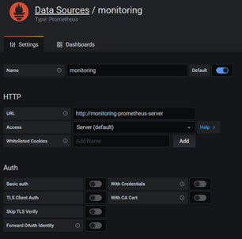

# Lyve Cloud analytics cluster monitoring dashboard

## Introduction
Lyve Cloud Analytics platform allows users to analyze and visualize their data in real-time. Grafana is an open-source platform for data visualization and analytics that can be used to monitor Lyve Cloud Analytics clusters. To use Grafana to monitor Lyve Cloud Analytics, you will need to set up a data source in Grafana that points to your Lyve Cloud Analytics cluster. 

Once you have set up the data source, you can use Grafana to create dashboards that display various metrics for your Lyve Cloud Analytics cluster. Iguazio platform includes a pre-deployed version of the Grafana analytics and monitoring platform. This tutorial outlines the steps for importing monitoring dashboard by using the Grafana data source to monitor your Lyve Cloud Analytics cluster can provide valuable insights into the performance and health of your data analytics infrastructure.

## Prerequisite

The setup of the Iguazio cluster should be completed.

## Running Steps
**Step 1:** Go to grafana dashboard.
1. Log into the Iguazio cluster using the admin user.
2. Go to the Clusters menu
3. Navigate to Clusters -> APPLICATION -> Status Dashboard. This will open the Grafana dashboard home page.

**Step 2:** Add a data source.

Before you can create your first dashboard, you need to add your data source.

Note: Only users with the admin role can add data sources.
1.	Select the cog icon on the side menu to show the configuration options. In configuration, select Data Sources.
	<p align="left" style="text-align:left"></p>

2.	This opens the data sources page, which displays a list of previously configured data sources for the Grafana instance.
3.	Select Add data source to see a list of all supported data sources.
	<p align="left" style="text-align:left"></p>
4.	Select Prometheus. This opens the data source configuration page.
5.	Configure the data source following instructions specific to the data source.
6.	Add monitoring data source if not already exists, Save & Test.
	* Name – monitoring
	* URL - http://monitoring-prometheus-server
	<p align="left" style="text-align:left"></p>
7.	Add app-monitoring data source, Save & Test.
	* Name - app-monitoring
	* URL - http://monitoring-prometheus-server.default-tenant.svc
	<p align="left" style="text-align:left"></p>
8.	After adding data sources, all configured data sources for the Grafana instance will be shown.
	<p align="left" style="text-align:left"></p>
	
**Step 3:** Import monitoring cluster templates.
1.	Download the json files from repository /code folder to your local system.
2.	Grafana dashboard on the create tab, select Import.
	<p align="left" style="text-align:left"></p>
3.	Click Upload json file. Select json file from local folder and import.
	<p align="left" style="text-align:left"></p>
4.	Repeat above step for all json templates.

## Sample dashboards -
1. Cluster Monitor
   <p align="left" style="text-align:left"></p>
2. Kubernetes Compute Resources Node Groups
   <p align="left" style="text-align:left"></p>
3. Spark Applications
   <p align="left" style="text-align:left"></p>
4. Spark UI
   <p align="left" style="text-align:left"></p>

## Tested by
* Feb 13, 2023: Vikram Godse (vikram.t.godse@seagate.com)


### Project Structure
```
.
├── README.md
├── code
│   └── Cluster Monitor.json
│   └── Kubernetes_ Compute Resources_ Node(Groups).json
│   └── Spark UI.json
│   └── Spark_ Applications.json
└── images
    └── add_data_source.png
    └── app_monitoring.png
    └── configuration_data_sources.png
    └── configured_data_sources.png
    └── create_dashboard_import.png
    └── monitoring.png
    └── upload_json.png	
    └── cluster_monitor.png
    └── kubernetes_compute_resources_node_groups.png
    └── spark_applications.png
    └── spark_ui.png	
```

### `/code`
This folder contains all the code files.

### `/images`
This folder contains all the images.
