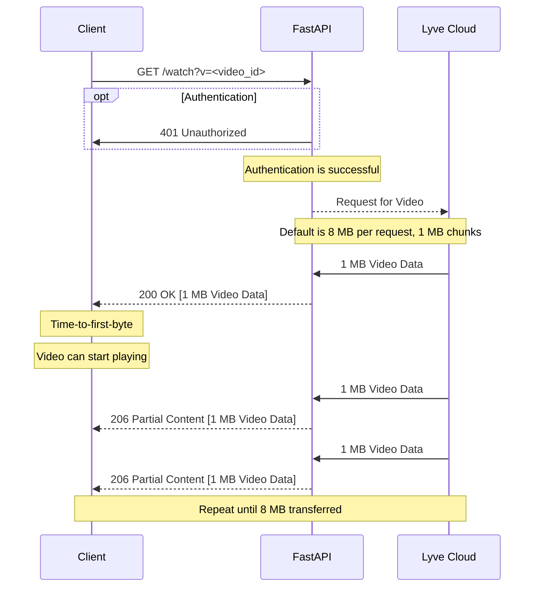
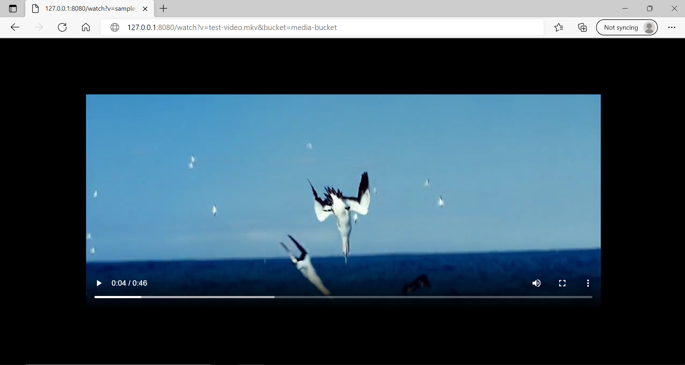
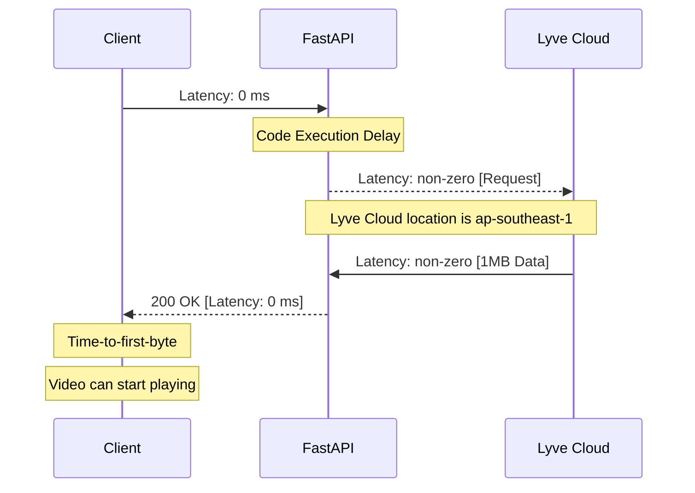

# Optimized Video Streaming

[Video Link](https://youtu.be/6TytfmOkqGk)

## Introduction
This is a middleware solution built with Python and [FastAPI](https://fastapi.tiangolo.com/), which is optimized for video streaming. 

It serves as a middleware from the browser request to the requested object, which is the video file. The implementation is based on the [Range Requests Specification in RFC 7233](https://datatracker.ietf.org/doc/html/rfc7233).

The code has comments in the individual functions to provide further explanations in regard to the different features.

The sequence diagram below shows how the middleware acts for a browser request from a client.



## Requirements
* Lyve Cloud access and secret keys. These can be obtained from the Lyve Cloud Console by creating a new Service Account to be used by this solution.
* [`Python3`](https://www.python.org/downloads/).


## Known Limitations 
This solution does not do any caching like Redis. It is merely a transfer from the Lyve Cloud endpoint currently. Caching is a future implementation which either be done on both the middleware or CDN level. 

## Running Steps
**Step 0:** Change your directory to `/code` if you are not already in `/code`. All following steps are done in `/code`.


**Step 1:** Get your Lyve Cloud bucket credentials.   
Here's what you'll need:
* Access Key
* Secret key
* Region Name
* Endpoint URL

**Step 2:** Enter your credentials in [config.json file](code/config.json):
```
    "access_key": "",
    "secret_key": "",
    "region_name": "",
    "endpoint_url": ""
```

**Step 3:** Install all required packages: `pip3 install -r requirements.txt`.


**Step 4:** Run the python file (development mode) using 
```
uvicorn main:app --host 127.0.0.1 --port 8080 --reload
```

**Step 5:** Stream media.

Any video from your Lyve Cloud storage is accessible via the following link:

`http://127.0.0.1:8080/watch?v=<video-name>&bucket=<bucket-name>`

e.g. http://127.0.0.1:8080/watch?v=my-video.mp4&bucket=my-media-bucket

This link can be played via browser or media player.
<p align="center">
  <br>
</p>

**Additional Features:**
Besides streaming media, the following requests are supported by the solution:
* List Bucket
* List Objects
* Create Bucket
* Upload Object

Visit http://127.0.0.1:8080/docs for full documentation.

## Results 

From Chrome's DevTools, the TTFB for a 206 Partial Content is on average roughly ~30-70 ms. This is using the default of 1 MB Byte Range requests.

However, this is done on a local environment with 0 distance latency from Client to FastAPI. 



This means that the ~30-70ms is roughly equivalent to the latency of the Lyve Cloud endpoint and the code implementation execution runtime.

Additional latency on production would be the latency of the CDN / FastAPI endpoint from the client. (Which may include SSL latency delay, authentication delay, etc)


## Tested by
* September 18, 2022: Sasha Chernin (alexander.chernin@seagate.com) on Ubuntu 20.04.

### Project Structure
```
.
├── README.md
├── code
│   └── main.py
│   └── config.json
│   └── requirements.txt
└── images
    └── ttfb-result-1.png
    └── streaming-video.png
```

### `/code`
This folder contains all the code files. It also includes the credentials file under config.json

### `/images`
This folder contains all the images used in this README.
