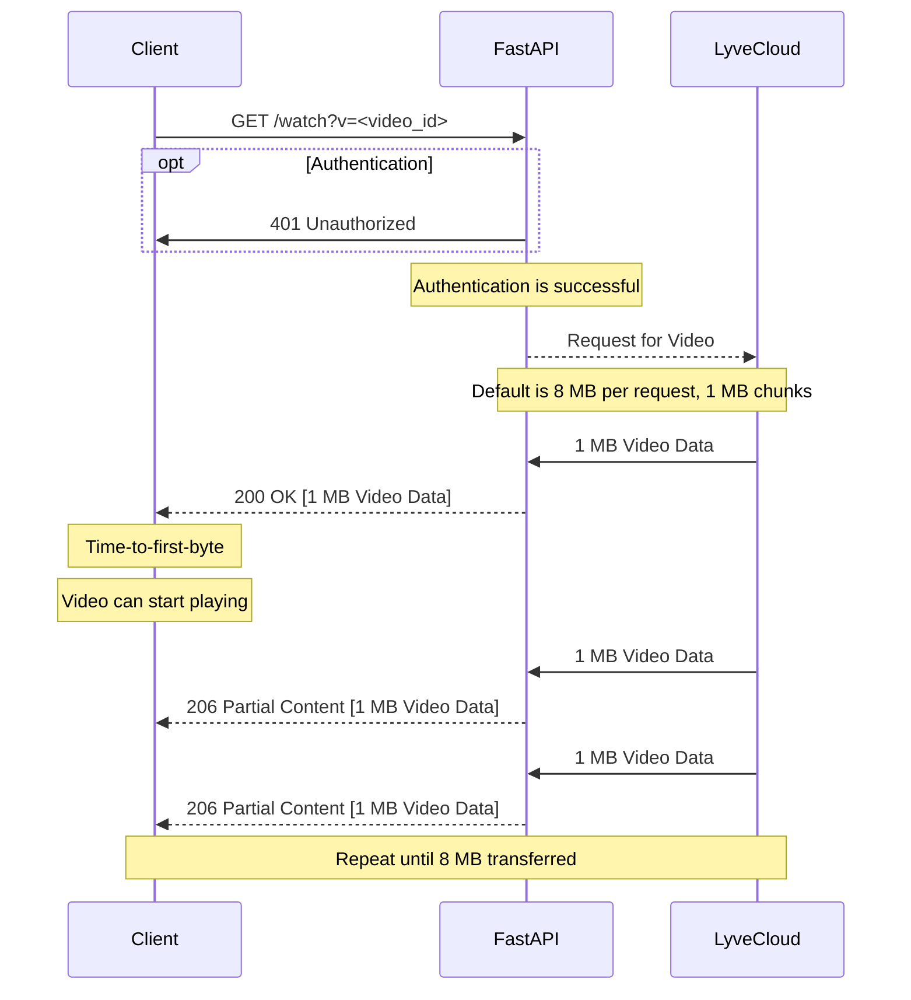
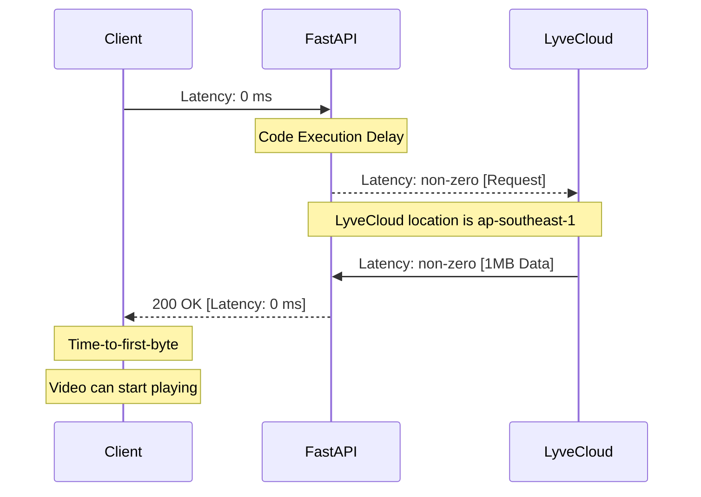
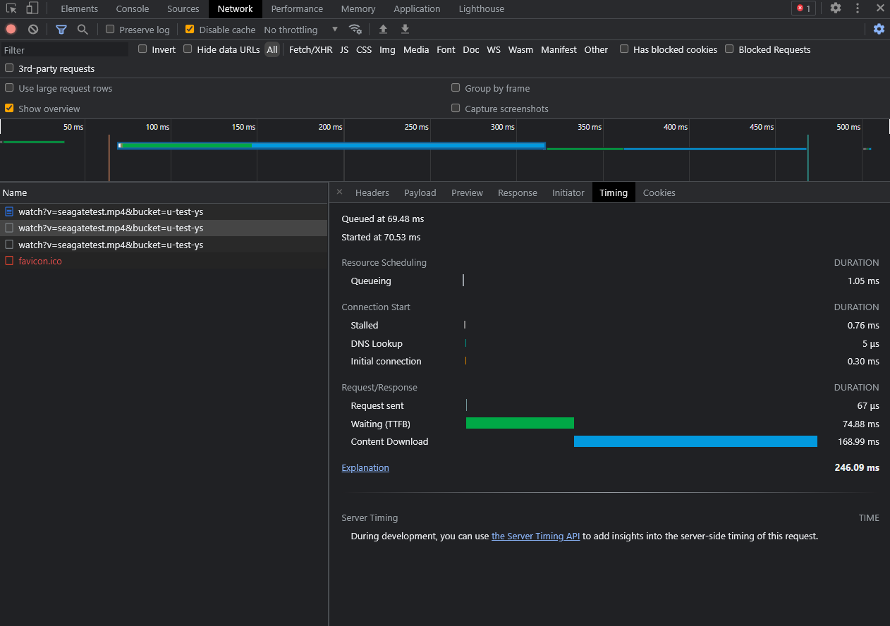

# Optimised Video Streaming

[Video Link](https://youtu.be/6TytfmOkqGk)

## Introduction
This is a middleware solution built on with Python and FastAPI, which is currently optimised for Video streaming. 

It serves as a middleware from the browser request to the requested object, which is the video file. The implementation is based off the Range Requests Specification in RFC 7233 https://datatracker.ietf.org/doc/html/rfc7233

The code is fully commented in the individual functions to provide further explanations in regards to the different features

The sequence diagram below shows how the middleware acts for a browser request from a client.



## Requirements
* Lyve Cloud Service Account credentials (Access Key, Secret key, and, Endpoint URL).
* [Python3](https://www.python.org/downloads/)


## Known Limitations 
This solution does not do any caching like Redis. It is merely a transfer from the LyveCloud endpoint currently. Caching is a future implementation which either be done on both the middleware or CDN level. 

## Running Steps
**Step 0:** Change your directory to /code if you are not already in /code. All following steps are done in /code


**Step 1:** Get your Lyve Cloud bucket credentials.   
Here's what you'll need:
* Access Key
* Secret key
* Region Name
* Endpoint URL

**Step 2:** Enter your credentials in [config.json file](code/config.json):
   * access key
   * secret key
   * region name
   * endpoint URL

**Step 3:** Install all required packages: `pip3 install -r requirements.txt`.


**Step 4:** Run the python file (development mode) using 
```
uvicorn main:app --host 127.0.0.1 --port 8080 --reload
```

**Step 5:** Head to the website demo or the docs at the following URLs
http://127.0.0.1:8080
http://127.0.0.1:8080/docs

## Results 

From Chrome's DevTools, the TTFB for a 206 Partial Content is on average roughly ~30-70 ms. This is using the default of 1 MB Byte Range requests.

However, this is done on a local environment with 0 distance latency from Client to FastAPI. 



This means that the ~30-70ms is roughly equivalent to the latency of the LyveCloud endpoint and the code implementation execution runtime.

Additional latency on production would be the latency of the CDN / FastAPI endpoint from the client. (Which may include SSL latency delay, authentication delay, etc)



### Project Structure

This section will describe the representation of each of the folders or files in the structure.
```
.
├── README.md
├── code
│   └── <script-name>
├── documentation
│   └── demo.mp4
│   └── introduction.pptx
└── images
    └── <image-name>
```

### `/code`
This folder contains all the code files. It also includes the credentials file under config.json

### `/images`
This folder contains all the images used in this README.
