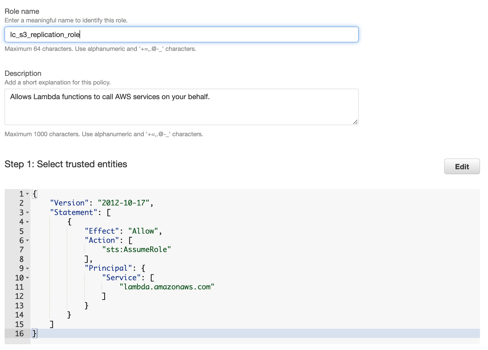
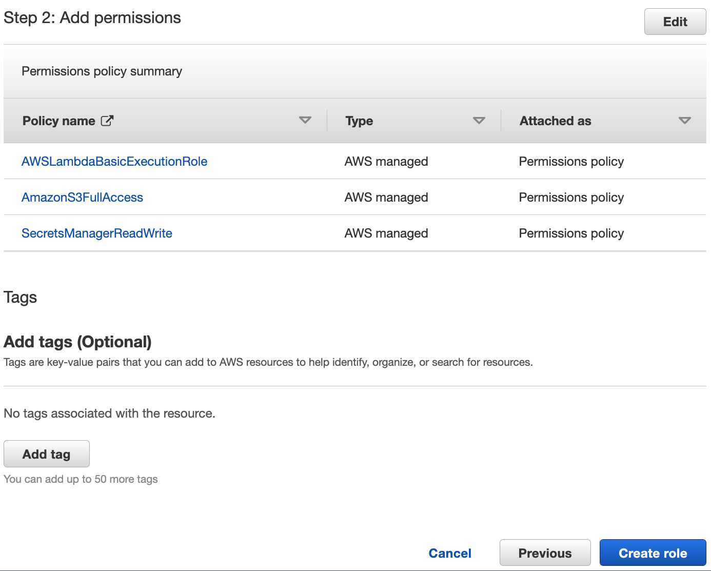
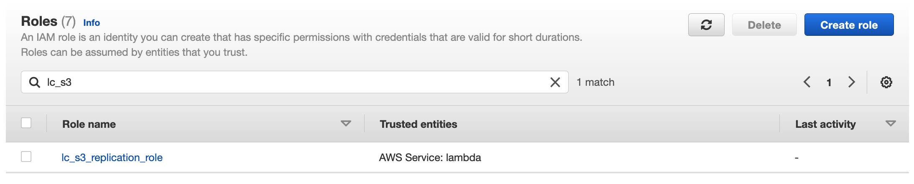
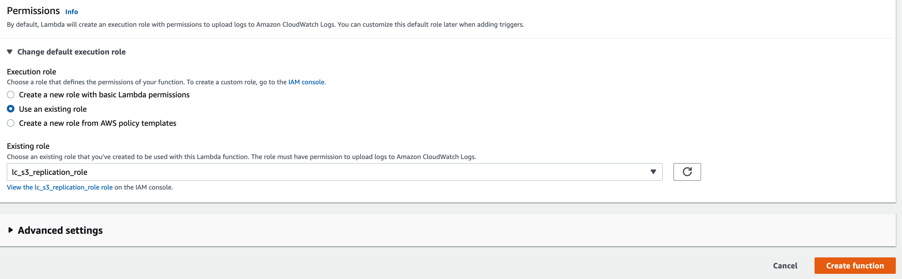
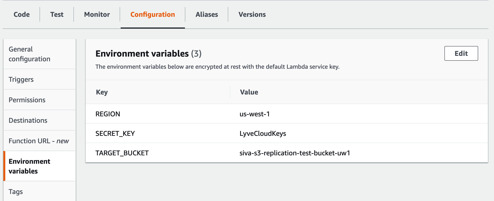
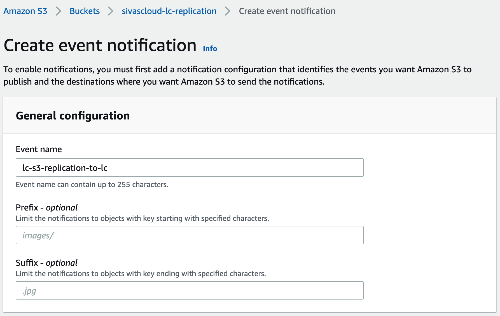
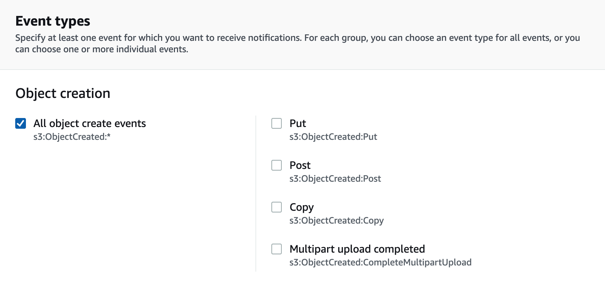
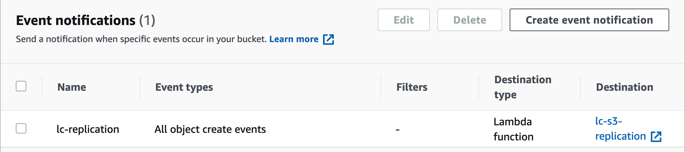

# S3 Replication to Lyve Cloud - using AWS Lambda

## Introduction
The purpose of this integration solution is to demonstrate how to automatically replicate AWS S3 new objects in a bucket (upto 10GB size) to a Lyve Cloud bucket using AWS Lambda.
AWS Lambda corresponds in this example to object create actions.

## Requirements
Before you start, please make sure you have these requirements and information in place:
- Lyve Cloud account
- Access to Lyve Cloud console to create/modify the following services:
	- Buckets
	- Permissions
	- Service Account
- Lyve Cloud access and secret keys. These can be obtained from the console by creating a new Service Account with appropriate permissions.
- Lyve Cloud bucket
- AWS account
- Access to AWS Management Console with necessary permissions to create/modify the following services:
	- IAM
	- Lambda
	- Secrets Manager
	- S3

## Known Limitations
This integration solution is a sample code to show how to automate, the replication of S3 objects from AWS to Lyve Cloud using S3 event notification and Lambda, but it’s not a complete solution. \
There are limitations and functionality gaps to handle before this sample code can be used in a production environment:
- Due to Lambda storage limitation objects bigger than 10GB will not be replicated and skipped.
- The sample code only replicates newly created objects from AWS S3 to Lyve Cloud as soon as they are created. Please note, existing objects are not replicated to Lyve Cloud.
- Error capturing and reporting is limited, some failures may not be reported.

**Note:** Full access permissions are provided for this sample code. However, for using this solution in a production environment the principle of the least privilege model should be applied.  The least privileges required to run this solution are:
- `s3:GetObject` - for `Resource` S3 ARN
- `secretsmanager:GetSecretValue` - for `Resource` Secret ARN
- `logs:CreateLogStream`
- `logs:CreateLogGroup`
- `logs:PutLogEvents`

A sample privilege in JSON format is given below in the [Appendix](#appendix) section

## Setup Instructions
### Step 1: Get Lyve Cloud credentials and endpoints
Login to Lyve Cloud console, create a Service Account with appropriate permissions and extract the following:
- Access Key
- Secret key
- Endpoint URL


### Step 2: Store Lyve Cloud credentials securely in AWS
1. Login to AWS Management console and go over to [Secrets Manager](https://console.aws.amazon.com/secretsmanager/home).
2. Click `Store a new secret`.
3. Choose `Other type of secret` for Secret type.
4. Under Key/value pairs, create key/value pairs for the following:
    * Key: `lc_access_key`, Value: `[Access key from step 1]`.
    * Key: `lc_secret_key`, Value: `[Secret key from step 1]`.
    * Key: `lc_endpoint_url`, Value: `[Endpoint URL including https:// from step 1]`.
<p style="text-align:left"></p>

5. Click `Next`.
6. Enter `Secret name` and make a note of it as you will need it during Lambda function creation. Rest of the field, you can leave it as default.
<p style="text-align:left"></p>

7. Click `Next`.
8. No need to set Secret rotation for this sample, so you can leave them to default.
9. Click `Next`.
10. Review the summary and Click `Store`.
11. Once created, you will see them under Secrets.
<p style="text-align:left"></p>


### Step 3: Create IAM policy for Lambda function
1. In the AWS Management Console go over to [IAM](https://console.aws.amazon.com/iamv2/home).
2. Under Access Management, Click `Roles`.
3. Click `Create role`.
4. Choose `AWS service` for Trusted entity type.
5. Choose `Lambda` for Use case.
<p style="text-align:left"></p>

6. Click `Next`.
7. Choose the following `Permissions policies`.
	* `AWSLambdaBasicExecutionRole`
	* `AmazonS3FullAccess`
	* `SecretsManagerReadWrite`

8. Click `Next`.
9. Enter `Role name`, verify permissions and Click `Create role`.
<p style="text-align:left"></p>
<p style="text-align:left"></p>

10. Make a note of the Role name as you will need it during Lambda creation.
 <p style="text-align:left"></p>


### Step 4: Create Lambda function
1. In the AWS Management console go over to [Lambda](https://console.aws.amazon.com/lambda/home).
2. Click `Create function`.
3. Choose option `Author from scratch`.
4. Enter `Function name` and choose `Python 3.9` for Runtime.
 <p style="text-align:left"></p>

5. Choose `Use an existing role` and pick the role created earlier from the drop-down list.
 <p style="text-align:left"></p>

6. Click `Create function`.
7. Open the Lambda function.
8. Copy and Paste the contents of [lambda_function.py](code/lambda_function.py) into the Code source section.
9. Click `Deploy`.
 <p style="text-align:left"></p>

10. Ensure the Handler is set `lambda_function.lambda_handler`.
 <p style="text-align:left"></p>

11. Go over to the tab `Configuration`.
12. Edit `General configuration` and set Timeout to max 15 mins, Memory to at least 1024 MB and Ephemeral storage to max 10240 MB.
 <p style="text-align:left"></p>

13. Edit `Environment variables` to add the following Key/Value pairs.
	* Key: `REGION`, Value: `<target Lyve Cloud bucket region>`
	* Key: `SECRET_KEY`, Value: `LyveCloudKeys` – Secret name created earlier.
	* Key: `TARGET_BUCKET`, Value: `<target Lyve Cloud bucket name>`
 <p style="text-align:left"></p>


### Step 5: Create S3 Event notification to call Lambda function
1. In the AWS Management console go over to [Amazon S3](https://console.aws.amazon.com/s3/home).
2. Choose S3 bucket you desire to replicate.
3. Click `Properties` tab.
4. Click `Create event notification` under `Event notifications`.
5. Enter a name.
 <p style="text-align:left"></p>

6. Choose `All object create events (s3:ObjectCreated:*)` under Event types.
 <p style="text-align:left"></p>

7. Under `Destination`.
8. Choose `Lambda function` and pick the lambda function created earlier from the drop-down list.
 <p style="text-align:left"></p>

9. Click `Save changes`.
10. Once successfully created, it should show under Event notifications as follows:
 <p style="text-align:left"></p>


### Step 6: Test S3 replication to Lyve Cloud
1. Upload a file/folder or Create folder in the S3 bucket.
 <p style="text-align:left"></p>

2. Check in the target Lyve Cloud bucket to see the file/folder is created.


## Architecture Diagram
Given below is the overall architecture diagram of this solution:
 <p style="text-align:center"></p>


## Tested by:
* May 9, 2022: Siva Gurunathan (siva.gurunathan@seagate.com) on Windows
* july 20, 2022: Bari Arviv (bari.arviv@seagate.com) on MacOs


### Project Structure

This section will describe the representation of each of the folders or files in the structure.
```
.
├── README.md
├── images
│   └── <Collection of .png files>
└── code
    └── lambda_function.py
```

### `/images`
Contains images for the documentation.

### `/code`
This folder contains the lambda functions that are used to pull lyve cloud bucket metrics.


## Appendix
Given below a sample least privileges required for this solution in JSON format
```
{
    "Version": "2012-10-17",
    "Statement": [
        {
            "Sid": "Sid0",
            "Effect": "Allow",
            "Action": [
                "s3:GetObject"
            ],
            "Resource": [
                "arn:aws:s3:::BUCKET_NAME/*"
            ]
        },
        {
            "Sid": "Sid1",
            "Effect": "Allow",
            "Action": [
                "secretsmanager:GetSecretValue"
            ],
            "Resource": [
                "arn:aws:secretsmanager:us-west-1:ACCOUNT_ID:secret:SECRET_NAME"
            ]
        },
        {
            "Sid": "Sid2",
            "Effect": "Allow",
            "Action": [
                "logs:PutLogEvents"
            ],
            "Resource": [
                "arn:aws:logs:*:ACCOUNT_ID:log-group:*:log-stream:*"
            ]
        },
        {
            "Sid": "Sid3",
            "Effect": "Allow",
            "Action": [
                "logs:CreateLogStream",
                "logs:CreateLogGroup"
            ],
            "Resource": "arn:aws:logs:*:ACCOUNT_ID:log-group:*"
        }
    ]
}
```
