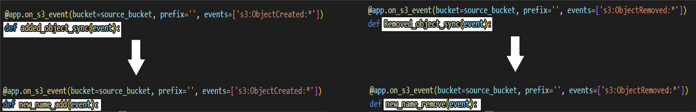

# Syncer – migrate and sync between AWS bucket to Lyve Cloud bucket automatically

## Introduction
This integration solution includes two parts, migrate then sync. First migrate Lyve Cloud S3 bucket objects from AWS S3 - moving all objects from AWS source to Lyve Cloud.
Second, sync using AWS Chalice framework. It will create two AWS Lambdas which will monitor any object creation\deletion event in source AWS bucket and will duplicate the operation to same objects in Lyve Cloud destination bucket. 

## Requirements
* [`Python3`](https://www.python.org/downloads/) and above is required.
* [`AWS CLI v2`](https://docs.aws.amazon.com/cli/latest/userguide/getting-started-install.html) and above is required.
* [`Docker v20.10.12`](https://docs.docker.com/get-docker/) and above is required.
* Lyve Cloud access and secret keys. These can be obtained from the Lyve Cloud Console by creating a new Service Account to be used by this solution.

## Known Limitations
* Lambda storage is limited to 10GB, therefore objects bigger than 10GB will not be replicated. They will be skipped. The user have to configure the max lambda size by himself (inside the lambda configurations).
* Lambdas generated will be unique for set of two buckets, secret keys, and IAM roles (meaning the user will have to create different secret keys and **different lambdas** for new buckets before run).
* The integration is limited to working with AWS **default profile**.

## Running Steps
### Step 1: Get your Lyve Cloud bucket credentials
Login to Lyve Cloud console, create a Service Account with appropriate permissions and extract the following:
* Access Key
* Secret key
* Endpoint URL

### Step 2: Generate and configure AWS keys
1. Login to AWS and go over to [IAM](https://console.aws.amazon.com/iamv2/home).
2. Click on the "Users" tab.
3. Click "Add Users".
4. Enter any username you would like. Under the "Select AWS access type" select "Access key - Programmatic access".
5. In the permissions page, select "Attach existing policies directly".
6. Search the following policies and select to add them (**Warning: all the policies will provide full access):
   1. SecretsManagerReadWrite
   2. CloudWatchFullAccess
   3. AmazonS3FullAccess
   4. AWSLambdaRole
   5. AWSLambda_FullAccess
   6. AmazonS3ObjectLambdaExecutionRolePolicy
7. Click "Next: Tags".
8. Click "Next: Review".
9. Click "Create user".
10. Your keys are now generated, copy the "Access Key ID" and "Secret access key".
11. Please [configure AWS credentials](https://docs.aws.amazon.com/cli/latest/userguide/cli-configure-files.html) for ***default profile***.

### Step 3: Migration setup 
1. Run: `cd migrate`
2. Fill in the necessary lines inside the brackets of the commands below (***without quotation marks and delete the scopes***):
```
docker build -t s3syncer .
docker run --name s3syncer --rm -i -t s3syncer bash
export AWS_DEFAULT_REGION=[Enter bucket region]
export AWS_ACCESS_KEY_ID= [Enter AWS access key]
export AWS_SECRET_ACCESS_KEY=[Enter AWS secret key]
export SOURCE_BUCKET=[Enter AWS source bucket]
export SOURCE_FOLDER=/data
export TARGET_FOLDER=/data
export TARGET_BUCKET=[Enter LyveCloud destination bucket]
python3 backup.py
export AWS_ACCESS_KEY_ID=[Enter LyveCloud access key]
export AWS_SECRET_ACCESS_KEY=[Enter LyveCloud secret key]
export ENDPOINT=[Enter LC ENDPOINT]
python3 restore.py
```
3. Copy and paste all the commands (after your changes) to terminal and press enter, if python command didn't execute press enter again.
4. Exit from the docker container when the migration is completed using `exit`.

#### Results
When objets are copied successfully:
```
Output:
b'Completed 36 Bytes/36 Bytes (39 Bytes/s) with 1 file(s) remaining\rdownload: s3:// source bucket /out.txt to ../data/file name in source\n'
```

### Step 4: Sync operation setup
1. Run: `cd ../syncer`
2. Run the cli tool. Explanation of the cli parameters:
```
python3 syncer_cli.py run --help
Usage: syncer_cli.py run [OPTIONS] lc_region lc_endpoint secret_name lc_access_key lc_secret_key source_bucket target_bucket
   
  The tool has two options:
  - Create a new secret from AWS SecretManager
  - Use an existing secret using -e or --exit flag
  -----------------------------------
  lc_region:     lyve cloud region name
  lc_endpoint:   lyve cloud endpoint
  secret_name:   secret key for secret manager
  lc_access_key: lyve cloud access key
  lc_secret_key: lyve cloud secret key
  source_bucket: aws bucket name
  target_bucket: lyve cloud bucket name

Options:
  -e, --exist  Boolean flag to use an existing key, for example: -e=true
  --help       Show the command opthions
```

#### Store Lyve Cloud credentials manually securely in AWS SecretManager
1. Login to AWS Management console and go over to [Secrets Manager](https://console.aws.amazon.com/secretsmanager/home).
2. Click `Store a new secret`.
3. Choose `Other type of secret` for Secret type.
4. Under Key/value pairs, create key/value pairs for the following:
   * Key: `lc_access_key`, Value: `[Access key from step 1]`.
   * Key: `lc_secret_key`, Value: `[Secret key from step 1]`.
   * Key: `lc_endpoint_url`, Value: `[Endpoint URL including https:// from step 1]`.
<p style="text-align:left"></p>

5. Click `Next`.
6. Enter `Secret name` and make a note of it as you will need it during Lambda function creation. Rest of the field, you can leave it as default.
<p style="text-align:left"></p>

7. Click `Next`.
8. No need to set Secret rotation for this sample, so you can leave them to default.
9. Click `Next`.
10. Review the summary and Click `Store`.
11. Once created, you will see them under Secrets.
<p style="text-align:left"></p>

#### Results
After a successful implementation two lambdas and the requested secret key should be created. Output example:
```
Configuring S3 events in bucket aws_bucket to function syncer-dev-added_object_sync
Creating IAM role: syncer-dev-Removed_object_sync
Creating lambda function: syncer-dev-Removed_object_sync
Resources deployed:
  - Lambda Layer ARN: arn:aws:lambda:us-east-1:secretnumber:layer:syncer-dev-managed-layer:30
  - Lambda ARN: arn:aws:lambda:us-east-1:secretnumber:function:syncer-dev-added_object_sync
  - Lambda ARN: arn:aws:lambda:us-east-1:secretnumber:function:syncer-dev-Removed_object_sync
```
## Second run 
To run again please change the names of the lambda functions located in 'app.py' 
1. Click `syncer` directory
2. Click `app.py` file
3. Rename both of the lambdas
example : 
change the name to "new name" in app.py :
<p style="text-align:left"></p>


## Tested by:
* May 15, 2022: Bari Arviv (bari.arviv@seagate.com) on Ubuntu 20.4
* June 29, 2022: Leon Markovich (leon.markovich@seagate.com) on Ubuntu 20.4

### `/migrate`
This folder contains all files needed for migration docker between AWS bucket and Lyve Cloud.

### `/syncer`
This folder contains all files needed for syncing between AWS bucket and Lyve Cloud after each create\delete object operation.

### `/images`
Contains images for the documentation.
